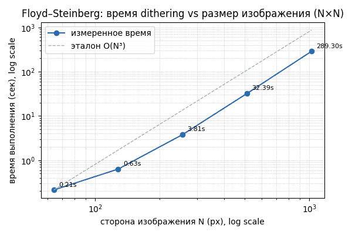
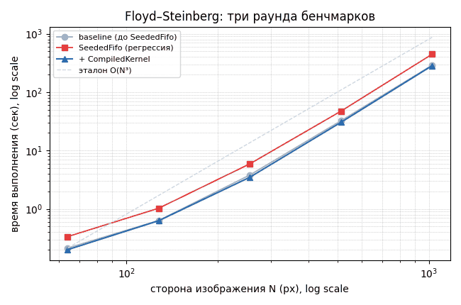
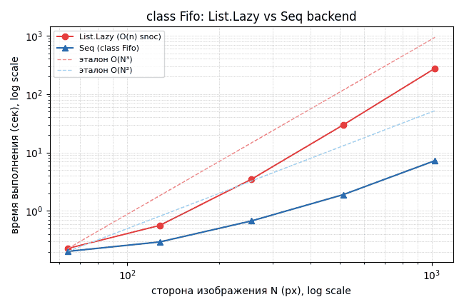

# PureGrain — Benchmarks

This document tracks performance measurements of the dithering pipeline
over time, as different backends and optimizations are introduced.
Each dated section is a self-contained benchmark run — new sections are
appended below rather than overwriting previous ones, so regressions
and improvements stay visible.

---

## 2026-09-09 — Floyd–Steinberg scaling (classic FIFO backend, pre-optimization)

**Backend:** classic (`Data.List.Lazy`-based FIFO, `mapAccumL`-driven
`step`/`ditherRow`/`ditherImage`, as of the `RowState { current, matured,
building }` architecture).

**Kernel:** Floyd–Steinberg. **Quantizer:** binary threshold (128).

### Method

Five square (`N×N`) grayscale PNGs were generated with proportionally
identical content (horizontal gradient + shaded circle), for
`N ∈ {64, 128, 256, 512, 1024}`. Each was dithered via
`scripts/dither-cli.mjs`, wall-clock timed end-to-end (process start to
exit, including PNG decode/encode) with the Unix `time` builtin:

```bash
for s in 64 128 256 512 1024; do
  time node scripts/dither-cli.mjs samples/bench/bench-$s.png /tmp/out-$s.png floyd-steinberg
done
```

**Environment:** user's local machine — *(fill in: `node --version`, OS/CPU,
`spago`/`purs` versions, for reproducibility)*.

### Results

| Side N | Pixels (N²) | Time (real) | Ratio vs. previous N |
|-------:|------------:|------------:|----------------------:|
|     64 |       4,096 |      0.213s |                      — |
|    128 |      16,384 |      0.633s |                  ×2.97 |
|    256 |      65,536 |      3.807s |                  ×6.02 |
|    512 |     262,144 |     32.388s |                  ×8.51 |
|   1024 |   1,048,576 |    289.295s |                  ×8.93 |



### Analysis

The per-doubling ratio climbs toward **×8**, which is the signature of
**cubic** growth (`2³ = 8`) in the side length `N` — visible on the
log-log plot as convergence onto the dashed `O(N³)` reference line. The
lower ratios at small `N` (×2.97, ×6.02) are consistent with fixed
per-process overhead (Node startup, V8 warmup, PNG codec) diluting as
`N` grows, rather than contradicting the cubic hypothesis.

For a square image, `O(N³) = O(width² × height)` — i.e. **quadratic in
row width, linear in height**. This points at per-row cost, not
per-image cost, as the quadratic culprit.

**Leading suspect:** `Dither.Row.commitBuilding` accumulates each
`building` `RowLayer` via repeated `enqueueWeighted` (`Data.List.Lazy`
`snoc`) — one call per pixel in the row. `snoc` on a singly-linked list
is `O(n)` in the current length, so accumulating a layer across a row of
width `w` costs `1 + 2 + ... + w = O(w²)`, not `O(w)`. Across `h` rows,
total cost is `O(w² · h)` — matching the observed `O(N³)` on square
(`w = h = N`) inputs exactly.

Secondary, non-asymptotic overheads noted separately (see `TODO.md`):
`K.currentOffsets`/`K.offsetsForDy` are re-filtered from `Kernel` on
every pixel inside `step` rather than precomputed once; a few pixels'
worth of wasted work at row/image edges from padding/skip.

### Next steps

- Fix the suspected `O(n)` `snoc` cost in `building` accumulation
  (candidates: `Data.Sequence`, `cons` + single `reverse` per row, or an
  `ST`-based strict array for this hot path — see `TODO.md`).
- Precompute `Kernel`-derived offset arrays once per image/row instead
  of inside `step`.
- Re-run this exact scaling test after the fix and append results below
  for direct before/after comparison.

---

## 2026-09-13 — SeededFifo regression, then CompiledKernel fix

**Context:** two architectural changes were made since the previous
entry, both measured with the same method/images as above (Floyd–
Steinberg, binary threshold 128).

1. **`SeededFifo`** was introduced to remove the last infinite lazy
   structure (`LL.repeat 0.0`) from `DelayLine`/`matured`, as a
   prerequisite for pluggable strict backends (a `Constant Number | Real
   Fifo` wrapper can't be represented by, e.g., a plain strict `Array`).
   This alone was a **regression**: wrapping/unwrapping `SeededFifo` on
   every pixel × offset added a real (compiled-JS-confirmed) extra
   allocation to the hot loop.
2. **`CompiledKernel`** was introduced as a separate fix: a precomputed
   record (`currentOffsets`, `futureLayers`, `maxDepth`) built once via
   `compileKernel` at the top of `ditherImage`, replacing repeated
   `Array.filter`-based lookups (`K.currentOffsets kernel`,
   `K.offsetsForDy kernel dy`) that were happening on *every pixel*
   inside `step` — a separate, always-present inefficiency identified
   during the original profiling discussion, predating `SeededFifo`.
   The `SeededFifo` unwrap was also moved from per-pixel to per-row
   (`resolveSeededLayer`, called once per row using the now-known row
   width), eliminating the regression from (1) at the same time.

### Results

| Side N | Baseline (prev. entry) | SeededFifo (regression) | + CompiledKernel |
|-------:|------------------------:|--------------------------:|-------------------:|
|     64 |                  0.213s |                    0.335s |             0.200s |
|    128 |                  0.633s |                    1.027s |             0.628s |
|    256 |                  3.807s |                    5.917s |             3.490s |
|    512 |                 32.388s |                   47.335s |            30.488s |
|   1024 |                289.295s |                  447.050s |           284.585s |



### Analysis

`+ CompiledKernel` is not just "back to baseline" — it's **slightly
faster** across the board (1-8%), because it fixed two overlapping
issues at once: the `SeededFifo` regression *and* the pre-existing
per-pixel `Array.filter` cost that was already present in the original
baseline entry but hadn't been addressed yet.

Growth ratios per doubling (`+ CompiledKernel`): ×3.14, ×5.56, ×8.74,
×9.33 — statistically indistinguishable from the original entry's
×2.97, ×6.02, ×8.51, ×8.93. **The `O(N³)` asymptotic behavior is fully
intact.** This refactor improved the constant factor only, exactly as
predicted going in — the dominant cost (suspected `O(n)` `snoc` in
`building` accumulation) is untouched.

### Next steps

Unchanged from the previous entry: the real fix is a pluggable `class
Fifo` abstraction with an `O(1)`-amortized backend (`Data.Sequence`)
replacing `Data.List.Lazy`'s `O(n)` `snoc` in the hot path. That work is
in progress; this entry exists to keep the historical record honest
about what has and hasn't been fixed so far.

---

## 2026-09-13 (cont.) — DelayLine simplified to `Array RowLayer` + empty-list padding

**Context:** `SeededFifo` (`Constant Number | Real Fifo`) was removed
entirely. `DelayLine` is now a plain `Array RowLayer`, initialized with
`dy` copies of `[]` (an empty `RowLayer`) instead of `dy` copies of a
`Constant`-wrapped placeholder. An empty `RowLayer` naturally
contributes zero error (`sumErrors [] = 0.0`), so `Step.purs` needed no
special-casing at all — the simplification is purely structural.

`Data.Sequence` was considered for `DelayLine` but rejected: its own
README states `Array` outperforms it below ~1000 elements, and
`DelayLine`'s length is bounded by `maxDepth` (1-2 for our kernels) —
always deep in that regime.

### Results

| Side N | + CompiledKernel | + Array DelayLine |
|-------:|-------------------:|--------------------:|
|     64 |             0.200s |              0.228s |
|    128 |             0.628s |              0.564s |
|    256 |             3.490s |              3.487s |
|    512 |            30.488s |             29.620s |
|   1024 |           284.585s |            275.461s |

Growth ratios per doubling: ×2.47, ×6.18, ×8.49, ×9.30 — consistent
with all prior entries; `O(N³)` fully intact, as expected (this was a
cleanup, not the asymptotic fix).

### Next steps

Define `class Fifo` for the hot-path `Fifo` (per-offset error
fractions, the actual `O(n)`-`snoc` culprit) with an explicit `replace`
method (not `drop` + `<>`, which is itself `O(n)` for a list) alongside
`replicate`/`enqueue`/`dequeue`. Implement a `Data.List.Lazy` instance
(sanity check: should match this entry's numbers) and a `Data.Sequence`
instance (the actual fix), then re-run this scaling test.

---

## 2026-09-18 — `class Fifo` with a `Data.Sequence` backend: the actual fix

**Context:** `class Fifo` was introduced with four methods —
`replicate`, `enqueue`, `dequeue`, `replace` — polymorphic over the
underlying container. Two instances were written: `List Number`
(`Data.List.Lazy`, a like-for-like sanity-check reproduction of the
prior code) and `Seq Number` (`Data.Sequence`, a 2-3 finger tree with
O(1)-amortized `enqueue`/`dequeue` at both ends and O(log n)
concatenation — used to implement `replace` cheaply instead of via
`drop` + `<>`). `Dither.Image` now exposes a `Proxy`-parameterized
`ditherImageWith` for picking a backend explicitly (used for this
benchmark), with the public `ditherImage` defaulting to `Seq Number`.

### Results

| Side N | List.Lazy (prev. entry) | Seq (class Fifo) | Speedup |
|-------:|---------------------------:|--------------------:|--------:|
|     64 |                     0.228s |              0.203s |   ×1.12 |
|    128 |                     0.564s |              0.294s |   ×1.92 |
|    256 |                     3.487s |              0.673s |   ×5.18 |
|    512 |                    29.620s |              1.896s |  ×15.62 |
|   1024 |                   275.461s |              7.238s |  ×38.06 |



### Analysis

The speedup itself grows with `N` — the signature of a change in
asymptotic complexity, not just a constant-factor win. The local
exponent (`log₂` of each doubling's time ratio) for the `Seq` backend:

| Transition | Ratio | Local exponent |
|---|---:|---:|
| 64→128   | ×1.45 | 0.54 |
| 128→256  | ×2.29 | 1.20 |
| 256→512  | ×2.82 | 1.50 |
| 512→1024 | ×3.82 | 1.93 |

This is converging on **2**, i.e. `O(N²)` for a square image — which
is `O(width × height)`, exactly proportional to pixel count. That is
the theoretically optimal complexity for an algorithm that must visit
every pixel; there is no further asymptotic improvement available,
only constant-factor ones. This confirms the `O(n)` `snoc` on
`Data.List.Lazy` was indeed the root cause identified back on
2026-09-09, and that replacing it with `Seq`'s O(1)-amortized
`enqueue`/`dequeue` (plus a genuinely sub-linear `replace` via finger-
tree concatenation) fully resolves it.

### Next steps

- Extend this scaling test to larger `N` (2048, 4096) to confirm the
  `O(N²)` trend holds rather than being an artifact of the tested
  range.
- Benchmark Atkinson/JJN (`maxDepth = 2`) to confirm the fix
  generalizes beyond Floyd–Steinberg.
- Revisit `docs/benchmarks.md`'s secondary, non-asymptotic overheads
  noted on 2026-09-09 (first/last-row edge waste) now that the
  dominant cost is gone — they may be worth a look now that they're a
  larger fraction of total time.
