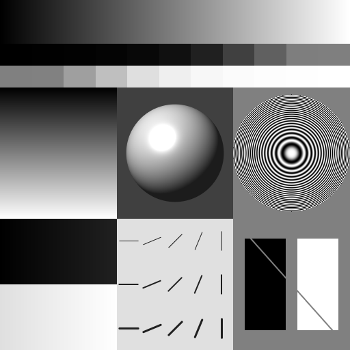
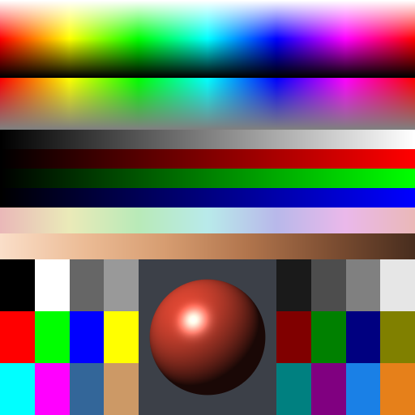

# Test images

One generator, `scripts/generate-images.mjs`, produces every image used for
visual dithering checks and for benchmarks. Everything is drawn procedurally
and deterministically: no randomness, so every run on every machine produces
byte-identical files. All geometry is proportional to the image size, so every
size shows the same composition.

There are two **composites**, `gray` and `color`. Each is built from named
**tiles**. A tile is one region with one purpose, and any tile can also be
rendered on its own at full size.

## Generating

```bash
npm run generate-images                         # samples/gray-512.png, samples/color-512.png
node scripts/generate-images.mjs --list         # composites, their tiles, one line each
node scripts/generate-images.mjs --pattern gray:zone-plate               # one tile, full frame
node scripts/generate-images.mjs --pattern gray --sizes 64,256,1024x256 --out samples/bench
npm run docs:images                             # refresh the previews in this document
```

| Option | Meaning | Default |
|---|---|---|
| `--pattern` | `all`, `gray`, `color`, or a tile id such as `color:sphere` | `all` |
| `--size` | `N` (square) or `WxH`, e.g. `512`, `1024x256` | `512` |
| `--sizes` | several sizes at once, comma-separated (instead of `--size`) | |
| `--out` | output directory | `samples` |
| `--list` | print composites and tiles, then exit | |

Files are named `<pattern>-<size>.png`, for example `gray-512.png`,
`color-1024x256.png`, `gray-zone-plate-512.png`. Gray images are written as
8-bit grayscale PNGs, color images as 8-bit RGB without alpha.

`samples/` is gitignored, because everything in it can be regenerated. The
only generated images in git are the two previews below, in
`docs/images/test-images/`. Refresh them with `npm run docs:images` whenever
a tile changes.

**Why 512² by default:** dither patterns have to be viewed at 1:1 (see
below), and 512 fits on screen at 100% while leaving each tile about 170 px
of interior. Benchmarks pass their sizes explicitly. Non-square sizes are
useful there: 1024×64 against 64×1024 separates cost per row from the number
of rows.

## How to look at dithered output

- **At 1:1 only.** At any zoom other than 100%, including desktop or HiDPI
  scaling, the viewer resamples the dot pattern. That averages dots into
  grays and creates moiré that isn't in the file.
- **Judge interiors, not borders.** Error diffusion scans rows left to right
  and pushes each pixel's error to its right and into the rows below,
  including down-left. So a region receives error from its left, upper and
  upper-right neighbours, and its top and left edges can show stray dots
  that aren't a bug. Its bottom and right edges receive nothing from the
  neighbours there.
- **Patterns need room to settle.** At the top-left of a flat area, and
  especially near black or white, dots only appear once enough error has
  built up (onset delay). The first rows of the whole image also start with
  empty error buffers, so they look different.
- **Clean and exact checks need a tile on its own:** `--pattern <tile-id>`.
  In the composite, neighbours send each other error, and some regions are
  too small to settle, such as the extreme wedge patches.
- **Ordered dithering without diffusion** (`--bayer N --kernel none`) has
  none of the border, onset and settling effects above: each pixel is
  decided on its own, so even narrow regions in the composites show their
  exact pattern. What to look for there is in
  [ordered-dithering.md](ordered-dithering.md#what-to-look-for).
- **For benchmarks, content doesn't matter.** Threshold, `nearestLevel` and
  `nearestColor` do the same work per pixel whatever its value. So timing
  runs can use the composites at any size, even 64², where regions are only
  a few pixels across and useless to look at.

## Gray composite



```
+---------------------------------------------------+
| gray:ramp                                         |  1/8
| gray:wedges                                       |  1/8
+----------------+----------------+-----------------+
| gray:vramp     | gray:sphere    | gray:zone-plate |  3/8
+----------------+----------------+-----------------+
| gray:shadows-  | gray:lines     | gray:edges      |  3/8
|   highlights   |                |                 |
+----------------+----------------+-----------------+
```

### `gray:ramp`
- **What:** a horizontal ramp, 0 at the left edge to 255 at the right. At
  widths of 256 or more, every one of the 256 levels appears.
- **Why:** the basic tone-reproduction test.
- **Look for:** dot density should change smoothly, from sparse white dots
  on black, through a checkerboard-like pattern at 50%, to sparse black dots
  on white. There should be no bands or jumps in density, and no directional
  streaks below the first few rows of the image.

### `gray:wedges`
- **What:** two rows of 11 flat patches. The dark row is 0, 1, 2, 4, 8, 16,
  32, 64, 96, 126, 127. The light row mirrors it (`v → 255 − v`): 128, 129,
  159, 191, 223, 239, 247, 251, 253, 254, 255.
- **Why:** exact levels where error diffusion is weakest, near black and
  white, plus the 50% point. Flat areas show the steady-state texture.
- **Look for:**
  - 0 and 255 should stay solid away from their top and left edges.
  - 1–8 and 247–254 should show sparse, evenly spread dots. Clumps, lines
    or empty stretches are artifacts.
  - The two rows should look roughly like negatives of each other. Not
    exactly: a threshold of 128 isn't symmetric around 127.5.
  - In the composite the patches are too narrow for the extreme levels to
    settle. Render `--pattern gray:wedges` alone to judge those.

### `gray:vramp`
- **What:** a vertical ramp, 0 at the top to 255 at the bottom.
- **Why:** the same tones as `gray:ramp`, changing along the other axis.
  Error diffusion is directional (rows left to right, error pushed right
  and down), so its artifacts depend on orientation.
- **Look for:** differences from `gray:ramp`. Rows of constant tone tend to
  form horizontal structures. The usual remedy is serpentine scanning, which
  alternates the direction from row to row.

### `gray:sphere`
- **What:** a sphere lit from the upper left, with a specular highlight, on
  a dark background. The rim is anti-aliased.
- **Why:** smooth shading in every direction, and a highlight that rolls off
  to pure white. It's the closest thing to natural image content here.
- **Look for:** banding in the shading. The highlight's edge should fade out
  rather than end in a hard ring. Also check the dark rim on the shadow side
  against the background.

### `gray:zone-plate`
- **What:** concentric rings, `cos(k·r²)`, whose frequency rises from zero
  at the center to the Nyquist limit at the edge of the circle. Nyquist is
  one light/dark cycle every 2 px, the finest detail pixels can hold.
  Outside the circle it's flat mid-gray.
- **Why:** the standard test for fine, regular detail. When the rings
  interfere with the dither's own texture, the result shows up as moiré.
- **Look for:** ring patterns or blotches that aren't in the input (compare
  with the preview). Some moiré near the rim is expected, because the input
  itself is at the limit of what pixels can show there. Floyd–Steinberg
  output shows clear moiré in the outer rings.

### `gray:shadows-highlights`
- **What:** two ramps covering only the extremes: 0→32 in the top half and
  223→255 in the bottom half. With 8-bit input, each level becomes a flat
  run several pixels wide.
- **Why:** it magnifies the tonal ranges where error diffusion produces its
  best-known artifacts.
- **Look for:** "worms", where dots line up into curved diagonal strings,
  and an empty strip at the start where no dots have appeared yet (onset
  delay). Floyd–Steinberg output shows both.

### `gray:lines`
- **What:** dark (32) line segments on light gray (224). Rows are line
  widths 1, 2 and 3 px; columns are angles 0°, 22.5°, 45°, 67.5° and 90°.
  Horizontal and vertical lines are pixel-aligned and crisp; the others are
  anti-aliased.
- **Why:** thin detail inside a textured (dithered) background.
- **Look for:** whether 1-px lines survive or break up into dots, and
  whether some angles suffer more than others. With Floyd–Steinberg and a
  threshold, the 1-px lines break up noticeably while 2–3 px lines survive.

### `gray:edges`
- **What:** a solid black block and a solid white block on mid-gray (128),
  crossed by a 2-px mid-gray diagonal.
- **Why:** hard edges between the extremes and a textured area. The
  diagonal is only visible where it crosses the blocks.
- **Look for:** stray dots leaking into the solid blocks. They're expected
  near the blocks' top and left edges (error arriving from the gray area),
  and should thin out quickly with distance from the edge. The diagonal
  should stay a visible dotted line on both black and white.

## Color composite



```
+----------------------------------------------------+
| color:hue-lightness                                |  3/16
| color:hue-saturation                               |  2/16
| color:channel-ramps  (gray, R, G, B)               |  3/16
| color:pastels-skin                                 |  2/16
+-----------------+----------------+-----------------+
| color:palette-  | color:sphere   | color:palette-  |  6/16
|   exact         |                |   midpoints     |
+-----------------+----------------+-----------------+
```

The sphere sits between the two patch grids on purpose. Side by side they
would read as one grid, and they carry opposite expectations: noise-free on
the left, a ~50/50 mix on the right.

### `color:hue-lightness`
- **What:** hue 0→360° across (red at both ends). Lightness runs from white
  at the top, through fully saturated in the middle row, to black at the
  bottom.
- **Why:** it covers the surface of the RGB gamut: every fully saturated
  hue at every lightness.
- **Look for:** hue shifts and banding where a palette covers a region
  poorly. With a small fixed palette (web-safe, black/white), check how well
  the colors the palette lacks are mixed from the ones it has.

### `color:hue-saturation`
- **What:** hue across, saturation from full at the top to zero at the
  bottom, at 50% lightness. The bottom row is neutral gray (128).
- **Why:** near-neutral colors are where color dithering most often adds
  colored noise.
- **Look for:** colored speckle in the lower, nearly gray rows. The bottom
  row should look neutral from a normal viewing distance.

### `color:channel-ramps`
- **What:** four stripes, top to bottom: gray `(v, v, v)`, red `(v, 0, 0)`,
  green `(0, v, 0)` and blue `(0, 0, v)`, each 0→255 from left to right.
- **Why:** each channel on its own. This is the scalarED view, where every
  channel is dithered independently.
- **Look for:** each stripe should behave like `gray:ramp` in its own
  channel. Gray comes first on purpose; see the exact checks below.

### `color:pastels-skin`
- **What:** a pastel hue sweep (high lightness, moderate saturation) in the
  top half. In the bottom half, a hand-picked light → dark range of skin
  tones (not a standard scale).
- **Why:** low-saturation, subtle colors, where noise and hue shifts are
  most visible to people.
- **Look for:** blotchy or colored noise, and hue shifts such as skin tones
  turning greenish or gray.

### `color:palette-exact`
- **What:** 12 flat patches in which every channel is one of the web-safe
  steps 0, 51, 102, 153, 204 or 255. They are black, white, two grays, the
  six primaries and secondaries, and two mixed colors.
- **Why:** every pixel is already a palette color, so the quantization
  error is exactly zero.
- **Look for:** with the web-safe palette the patches must come out
  noise-free. That means vectorED `nearestColor websafe216` (CLI:
  `--palette websafe216`), or the equivalent scalarED `perChannel
  (nearestLevel (evenRamp 6))` (CLI: `--levels 6`). Any dot is a bug. With
  other palettes they just dither normally.

### `color:sphere`
- **What:** a red-orange sphere lit from the upper left, with a white
  specular highlight, on a dark bluish-gray background.
- **Why:** smooth color shading. The highlight blends a hue into white, and
  the background is a dark near-neutral.
- **Look for:** banding and hue shifts across the shading, a hard ring
  around the highlight, and colored noise in the background.

### `color:palette-midpoints`
- **What:** 12 flat patches halfway between neighbouring web-safe steps in
  one or more channels. Exact midpoints (25.5, 76.5, 127.5, …) can't be
  stored in 8 bits, so each is rounded up by 0.5 (26, 77, 128, …), which
  puts it slightly closer to the upper step.
- **Why:** the settled mix of two neighbouring palette entries, i.e. the
  texture you get between palette colors.
- **Look for:** an even, fine ~50/50 pattern in each affected channel, with
  slightly more of the upper step. Clumping or visible structure is an
  artifact.

## Exact checks

`npm run check:cli` runs all of these through the real CLI (after
`npm run build`) and fails on the first one that doesn't hold.

Two tiles have exact, checkable expectations when rendered on their own
(`--pattern <tile-id>`), where no neighbouring region sends them error:

- **`color:palette-exact`, with the web-safe palette** (`--palette
  websafe216` or `--levels 6`): output equals input byte for byte, with any
  kernel. Every pixel is a palette color, so the error is zero everywhere.
- **`color:channel-ramps`, with scalarED (`--levels N`) or vectorED
  web-safe (`--palette websafe216`):** every pixel of the gray stripe stays
  exactly neutral (`r = g = b`). It's the first stripe, so all three
  channels start with zero error and identical input, and therefore produce
  identical output.

Neither holds in the composite. Neighbouring regions send in error, and
below colored content the three channels enter a gray area with different
error. Their dot patterns then fall out of step, so even a neutral area
shows colored dots: with `--levels 4`, 47% of the composite's gray-stripe
pixels came out colored. That's a property of dithering each channel
independently, not a bug.

One check covers the whole color composite: **`--palette websafe216` and
`--levels 6` must produce byte-identical files.** The web-safe palette is a
full 6×6×6 cube, so its nearest color is exactly the nearest step in each
channel separately, and vectorED and scalarED are the same computation (a
property also tested in `Test.Puregrain.PaletteSpec`). The two differ only in
cost: the palette search takes about twice as long (see
[benchmarks-dithering.md](benchmarks-dithering.md)).

Two more checks cover ordered dithering (`--bayer`), which passes no error
between pixels without a kernel, and keeps exact levels:

- **The whole color composite, with `--bayer 4 --kernel none --levels 4`:**
  every neutral pixel stays exactly neutral, wherever it is. All three
  channels of a pixel get the same value and the same threshold, and no
  error arrives from colored neighbours. (With error diffusion this only
  holds for a gray area rendered on its own; see above.)
- **`color:palette-exact`, with `--levels 6 --bayer 4`:** output equals
  input byte for byte, both with `--kernel none` and combined with
  Floyd–Steinberg. Every channel value is a level, and a level stays that
  level, so the error is zero everywhere.

Both are also properties in `Test.Puregrain.OrderedSpec`, for arbitrary
images, maps and levels.
